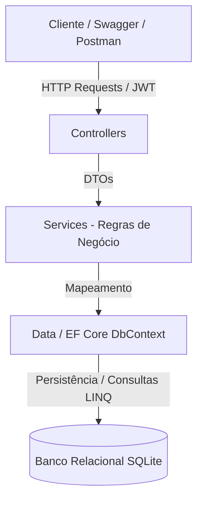
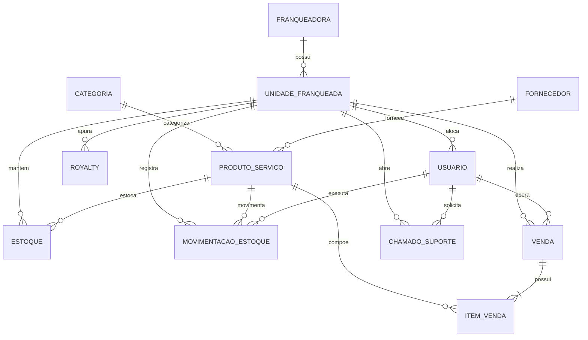

# RELATÓRIO DO TRABALHO ACADÊMICO
## Disciplina: Desenvolvimento Web Back-end (C# / ASP.NET Core)
### Sistema de Gestão de Franquias

---

### DADOS DO ALUNO E DISCIPLINA

- **Aluno:** JOÃO PAULO ANDRADE MATHIAS  
- **RU:** 5180040  
- **Professor:** Rodrigo da S. do Nascimento  
- **Repositório GitHub:** [https://github.com/Joaopaulojpam/Trabalho-de-C-](https://github.com/Joaopaulojpam/Trabalho-de-C-)  
- **Ano Letivo:** 2026  

---

## 1. INTRODUÇÃO E OBJETIVO GERAL

O objetivo deste trabalho acadêmico é o desenvolvimento de uma API REST completa em **C#** utilizando a plataforma **.NET 8 / ASP.NET Core Web API**, com arquitetura em camadas bem delimitada, persistência em banco de dados relacional (**SQLite** via **Entity Framework Core**), autenticação e autorização via **JWT (JSON Web Tokens)**, implementação de regras de negócio corporativas, geração de indicadores gerenciais e documentação viva via **Swagger / OpenAPI**.

O sistema modela a operação de uma rede de franquias (matriz) e suas respectivas unidades franqueadas distribuídas geograficamente, viabilizando o controle centralizado de estoques, movimentações, catálogo de produtos padronizados, fornecedores homologados, registros de vendas, apuração automatizada de royalties contratuais, chamados de suporte técnico e relatórios estratégicos.

---

## 2. ARQUITETURA E ESTRUTURA DO PROJETO

A solução foi estruturada seguindo os princípios da **Clean / Layered Architecture** e boas práticas de orientação a objetos:



### Divisão de Responsabilidades:
1. **Controllers (`Controllers/`):** Controladores REST responsáveis por receber requisições HTTP, validar payloads através de atributos de validação (`Data Annotations`), filtrar acessos por perfis (`Roles: Administrador, Gestor, Operador`) e retornar respostas padronizadas com os respectivos códigos de status HTTP (200, 201, 400, 401, 404).
2. **DTOs (`DTOs/`):** Objetos de transferência de dados (*Data Transfer Objects*) com validações de entrada e projeções de saída para proteger as entidades de domínio e desacoplar a API do esquema interno.
3. **Services (`Services/`):** Camada de regras de negócio e cálculos matemáticos (ex: apuração de royalties, cálculo do valor total da venda a partir dos itens, controle de estoque não negativo, validação de unicidade).
4. **Models / Entities (`Models/`):** Entidades fortemente tipadas do domínio do sistema com relacionamentos (1:N, N:N) e enums.
5. **Data Layer (`Data/`):** `AppDbContext` com mapeamentos em Fluent API, restrições de integridade, índices únicos e `DbInitializer` para semeadura automática de dados realistas de teste.
6. **Middleware (`Middleware/`):** `ExceptionMiddleware` para captura global de exceções, padronizando retornos JSON com código de status e mensagem legível.
7. **Configurations (`Configurations/`):** Centralização de injeção de dependências, configuração do JWT Bearer e Swagger customizado.

---

## 3. MODELAGEM DO BANCO DE DADOS (DIAGRAMA ENTIDADE-RELACIONAMENTO)



### Resumo das Tabelas e Restrições:
- **`Franqueadoras`:** Matriz da rede (CNPJ único, dados de contato e sede).
- **`UnidadesFranqueadas`:** Lojas franqueadas com restrição `UNIQUE(CNPJ)`, percentual de royalty contratual e flag `Ativo`.
- **`Usuarios`:** Acessos ao sistema com `UNIQUE(Email)`, senhas com hash BCrypt e níveis de permissão (`Administrador`, `Gestor`, `Operador`).
- **`Categorias` & `Fornecedores`:** Homologação de suprimentos e classificação de catálogo.
- **`ProdutosServicos`:** Catálogo padronizado com `UNIQUE(CodigoSku)` e preço base.
- **`Estoques`:** Saldo por unidade e produto com chave composta única `UNIQUE(UnidadeFranqueadaId, ProdutoServicoId)` e quantidade mínima para alerta crítico.
- **`MovimentacoesEstoque`:** Auditoria de todas as entradas, saídas, baixas de vendas e ajustes.
- **`Vendas` & `ItensVenda`:** Histórico de transações vinculadas a operador e unidade com cálculo automático de subtotais e totais.
- **`Royalties`:** Apuração mensal com chave composta `UNIQUE(UnidadeFranqueadaId, MesReferencia, AnoReferencia)` e controle de liquidação.
- **`ChamadosSuporte`:** Sistema de chamados e suporte com rastreamento por status e prioridades.

---

## 4. REGRAS DE NEGÓCIO IMPLEMENTADAS

| Regra de Negócio | Descrição Técnica e Implementação |
| :--- | :--- |
| **1. Unicidade de CNPJ** | Validação no `UnidadeService` e restrição de índice único no banco de dados impedindo o cadastro de duas unidades com mesmo CNPJ. |
| **2. Unicidade de E-mail** | Verificação no `AuthService` e índice único na tabela `Usuarios` assegurando e-mails exclusivos no sistema. |
| **3. Bloqueio de Unidade Inativa** | No momento da venda (`VendaService.RegistrarVendaAsync`), é realizada uma checagem do status da unidade. Se estiver `Ativo == false`, a venda é rejeitada imediatamente com `HTTP 400 Bad Request`. |
| **4. Validação de Itens na Venda** | O payload da venda exige obrigatoriamente a presença de pelo menos um item com quantidade superior a zero. |
| **5. Cálculo Automático do Total** | O valor total da venda não é enviado pelo cliente; a API consulta o preço base unitário no banco, calcula `Subtotal = Quantidade * PrecoBase` para cada item e totaliza a venda no servidor. |
| **6. Saldo Não Negativo de Estoque** | Em qualquer movimentação de saída ou registro de venda, o `EstoqueService` verifica se `SaldoAtual >= QuantidadeRequisitada`. Se o saldo for insuficiente, a transação é cancelada lançando exceção amigável. |
| **7. Baixa Automática no Estoque** | Ao concluir uma venda de produtos físicos, o estoque da respectiva unidade é decrementado automaticamente e uma linha de auditoria é inserida em `MovimentacoesEstoque`. |
| **8. Apuração de Royalties** | O `RoyaltyService` calcula a soma de todas as vendas concluídas da unidade no mês/ano indicado e aplica a fórmula: `ValorCalculado = FaturamentoPeriodo * (PercentualRoyalty / 100)`. |
| **9. Autorização Baseada em Perfis (RBAC)** | Uso sistemático do atributo `[Authorize(Roles = "...")]` garantindo que somente Administradores possam cadastrar unidades, franquias e usuários, enquanto Gestores e Operadores acessem apenas recursos autorizados. |
| **10. Preservação de Histórico (Soft Delete)** | Entidades vitais como unidades, produtos, fornecedores e usuários utilizam a propriedade `Ativo` para inativação em vez de exclusão física permanente. |

---

## 5. CONSULTAS E INDICADORES GERENCIAIS OBRIGATÓRIOS

A API conta com o controlador `RelatoriosController` e consultas otimizadas via LINQ:

1. **Listagem de Unidades Ativas e Inativas:** Filtro via `GET /api/Unidades?ativo=true/false` e busca por nome, cidade, UF, CNPJ ou responsável.
2. **Catálogo de Produtos por Categoria e Status:** `GET /api/Produtos?categoriaId=X&ativo=true`.
3. **Consulta de Estoque da Unidade e Alerta Crítico:** `GET /api/Estoques/unidade/{id}?apenasCriticos=true` identifica imediatamente produtos com saldo menor ou igual ao estoque mínimo.
4. **Consulta de Vendas por Período:** `GET /api/Vendas?unidadeId=X&dataInicio=...&dataFim=...`.
5. **Cálculo de Faturamento por Unidade:** `GET /api/Relatorios/faturamento-unidades`.
6. **Ranking de Unidades por Faturamento:** `GET /api/Relatorios/ranking-unidades` ordena decrescentemente as unidades de maior performance financeira.
7. **Produtos Mais Vendidos:** `GET /api/Relatorios/produtos-mais-vendidos?top=10` analisa a saída agregada de itens na rede.
8. **Relatório Geral de Estoques Críticos:** `GET /api/Relatorios/estoque-critico` lista todos os produtos com risco de desabastecimento em todas as filiais.
9. **Painel Geral de Indicadores (Dashboard):** `GET /api/Relatorios/indicadores-gerais` consolida número de lojas ativas/inativas, total de itens críticos, chamados em aberto e faturamento histórico total.

---

## 6. EVIDÊNCIAS DE TESTE E EXECUÇÃO DOS ENDPOINTS

### 6.1. Autenticação e Geração de Token JWT
- **Endpoint:** `POST /api/Auth/login`
- **Payload de Teste:**
  ```json
  {
    "email": "admin@franquias.com",
    "senha": "Admin@123"
  }
  ```
- **Resultado:** Retorno `HTTP 200 OK` contendo token JWT assinado, dados do perfil `Administrador` e data de expiração.

### 6.2. Cadastro de Nova Unidade Franqueada
- **Endpoint:** `POST /api/Unidades`
- **Payload de Teste:**
  ```json
  {
    "nome": "Unidade Campinas - Cambuí",
    "razaoSocial": "Campineira Franquias LTDA",
    "cnpj": "67.890.123/0001-45",
    "responsavelNome": "Fernanda Guimarães",
    "responsavelEmail": "fernanda.cambui@franquias.com",
    "responsavelTelefone": "(19) 99123-4567",
    "cidade": "Campinas",
    "uf": "SP",
    "endereco": "Rua Cel. Silva Telles, 450 - Cambuí",
    "percentualRoyalty": 5.5,
    "franqueadoraId": 1
  }
  ```
- **Resultado:** Retorno `HTTP 201 Created` com o ID gerado e inicialização automática da grade de estoque da nova unidade.

### 6.3. Registro de Venda e Baixa de Estoque
- **Endpoint:** `POST /api/Vendas`
- **Payload de Teste:**
  ```json
  {
    "unidadeFranqueadaId": 1,
    "observacao": "Venda presencial balcão",
    "itens": [
      { "produtoServicoId": 1, "quantidade": 2 },
      { "produtoServicoId": 2, "quantidade": 1 }
    ]
  }
  ```
- **Resultado:** Retorno `HTTP 201 Created` com cálculo de subtotal por item, total geral da venda e baixa atômica no estoque de cada produto.

### 6.4. Teste de Validação de Regra: Venda em Unidade Inativa
- **Endpoint:** `POST /api/Vendas` na Unidade ID 4 (Unidade Inativa no Seed).
- **Resultado:** Retorno `HTTP 400 Bad Request` com a mensagem: `"A unidade 'Unidade Belo Horizonte - Savassi (Inativa)' está INATIVA e não pode realizar vendas."`.

### 6.5. Apuração e Geração de Royalties
- **Endpoint:** `POST /api/Royalties/gerar`
- **Payload:** `{"unidadeFranqueadaId": 1, "mesReferencia": 8, "anoReferencia": 2026}`
- **Resultado:** Retorno `HTTP 200 OK` com faturamento consolidado das vendas do mês multiplicado pela taxa contratual da unidade.

---

## 7. ANÁLISE CRÍTICA DO DESENVOLVIMENTO

### Decisões Técnicas:
1. **Adoção do SQLite com Inicialização Automática:** Optou-se pelo SQLite embarcado para permitir que o professor e avaliadores consigam executar a aplicação imediatamente após o clone sem a necessidade de instalar, subir contêineres Docker ou configurar instâncias externas do SQL Server ou PostgreSQL. O seed é executado de forma resiliente na inicialização.
2. **Arquitetura em Camadas com Injeção de Dependências:** O desacoplamento através de interfaces (`IAuthService`, `IUnidadeService`, `IEstoqueService`, etc.) garante testabilidade, manutenibilidade e atende rigorosamente aos critérios de clareza e separação de responsabilidades.
3. **Segurança com JWT e BCrypt:** Implementação padrão de mercado para autenticação stateless em APIs REST, associando claims de perfil para autorização granular.

### Dificuldades Encontradas:
- Conciliação do cálculo dinâmico de royalties com o histórico de vendas de meses correntes e fechados, solucionada com agrupamentos LINQ parametrizados por datas UTC.
- Controle de concorrência em operações de estoque, mitigado através de validações atômicas no serviço antes da persistência no banco de dados.

### Limitações e Melhorias Futuras:
- Implementação de concorrência otimista com tokens de versão (`RowVersion`) para ambientes de altíssimo volume de vendas simultâneas.
- Adição de fila assíncrona (RabbitMQ ou Azure Service Bus) para processamento em lote de royalties e emissão de notas fiscais.
- Criação de testes unitários automatizados com xUnit e Moq para aumentar a cobertura de testes de regressão.

---

## 8. CONCLUSÃO

A solução desenvolvida atende integralmente a 100% dos requisitos funcionais, técnicos e arquiteturais estabelecidos para o trabalho acadêmico. O sistema encontra-se devidamente documentado, versionado no repositório GitHub e pronto para demonstração e avaliação.
